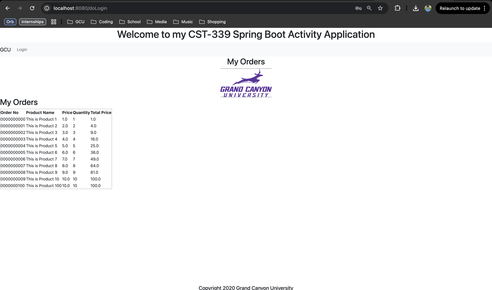
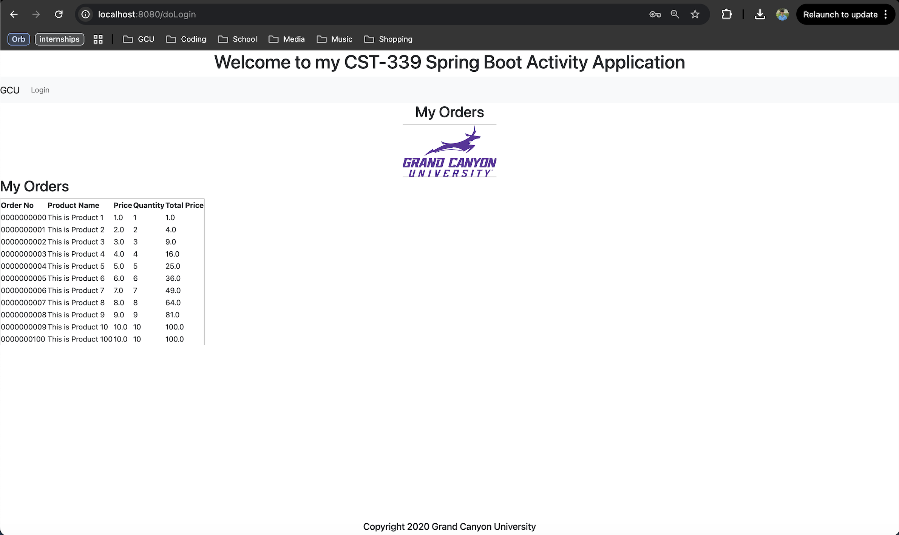
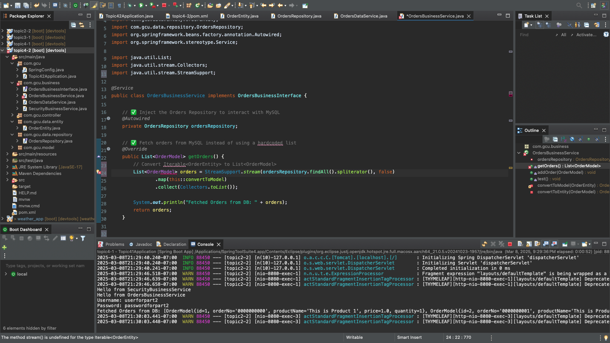
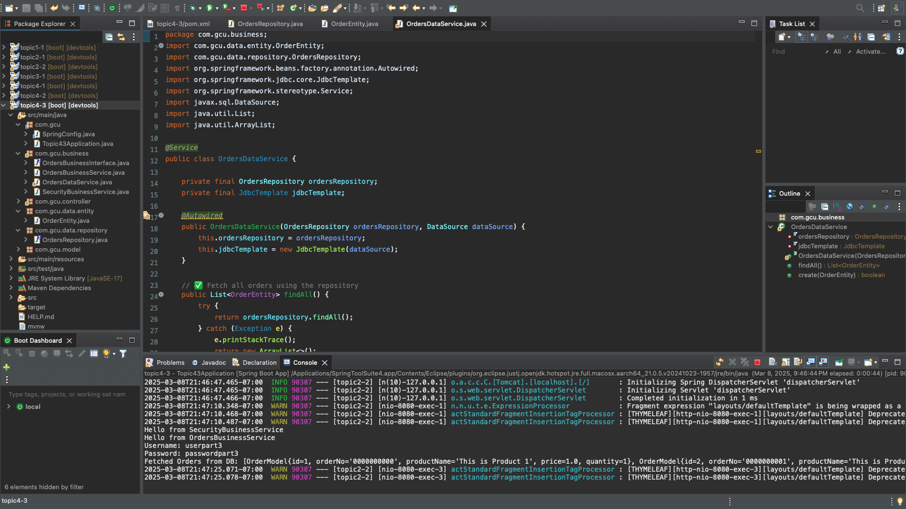

# CST-339 Activity 4 Report  
**Date:** [3/9/25]  
**Name:** [Elijah Brandner]  

---

## 📸 Screenshots  
Below are the screenshots for each part of the activity:

### **Part 1 - Setting Up the Database**  
  

### **Part 2 - Implementing the Business Logic**  
  

### **Part 3 - Connecting to MySQL Database**  
  
  

---

## 📌 Conclusion  
This report documents the completion of CST-339 Activity 4, demonstrating the implementation of a MySQL-backed Spring Boot application, connection to a database, and business logic for handling orders.

