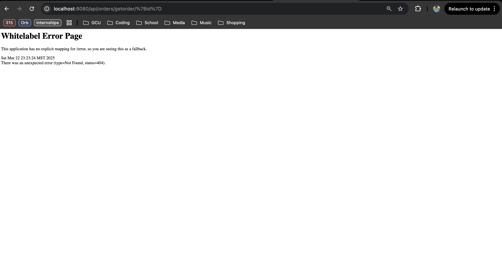

# CST-339 Activity 5 Report  
**Date:** [3/23/25]  
**Name:** [Elijah Brandner]  

---

## 📸 Screenshots  
Below are the screenshots for each part of the activity:

### **Part 1 - Setting Up MongoDB Atlas and Displaying Orders**  
  
  
  

### **Part 2 - Implementing Query by ID and Testing**  
  
  

---

## 📌 Conclusion  
This report documents the completion of CST-339 Activity 5, demonstrating the successful setup of a MongoDB-backed Spring Boot application, the integration of database queries via REST endpoints, and the ability to retrieve orders by ID. The project was built and tested both within the IDE and as a deployable JAR file, reflecting a solid understanding of full-stack configuration and data access patterns.

---

