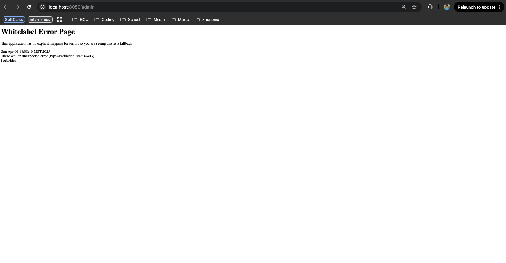

# CST-339 Activity 6 Report  
**Date:** 4/06/25  
**Name:** Elijah Brandner  

---

## 📸 Screenshots  

### **Part 1 – Securing a Web Application Using an In-Memory Datastore**  
- **Orders Page:**  
    
- **JSON REST API Response:**  
    
- **XML REST API Response:**  
    
- **JAR Build/Run Screenshot:**  
    

---

### **Part 2 – Securing a Web Application Using a Database (MongoDB Atlas)**  
- **Login with MongoDB Atlas Credentials:**  
    
- **Orders Page (after successful login):**  
    

---

### **Part 3 – Securing REST APIs Using Basic HTTP Authentication**  
- **Web UI - Admin Page (Admin Role):**  
    
- **Web UI - Admin Page (Regular User → 403):**  
    
- **Web UI - Login As Admin:**  
    
- **Web UI - Login As User:**  
    
- **Web UI - Orders (Admin):**  
    
- **Web UI - Orders (User):**  
    

- **Postman - /getjson with Good Credentials:**  
    
- **Postman - /getjson with Bad Credentials:**  
    
- **Postman - /getxml with Good Credentials:**  
    
- **Postman - /getxml with Bad Credentials:**  
    

---

### **Part 4 – Securing REST APIs Using OAuth2 Authentication**  
*(Due to unresolved integration issues, the OAuth2 endpoint did not function as expected; however, the GitHub OAuth App was registered correctly.)*  
- **GitHub App Registration:**  
    
- **GitHub Login Screen:**  
    
- **Intended Protected Endpoint (/service/test):**  
  

---

## 📌 Conclusion  
This report documents the completion of **CST-339 Activity 6**.  
- **Part 1:** Demonstrated the setup of a Spring Boot web application using an in-memory datastore for authentication. Screenshots include the orders page and JSON/XML REST API responses.  
- **Part 2:** Showed how to switch to a MongoDB Atlas-backed authentication system, with screenshots of a successful login and orders display.  
- **Part 3:** Implemented Basic HTTP authentication for REST APIs; screenshots capture both successful and failed (401 Unauthorized) responses via Postman.  
- **Part 4:** Spent Hours Attempting to secure a REST API using GitHub OAuth2. The GitHub OAuth App was registered correctly, and screenshots document the OAuth login screen and the intended service endpoint, although integration issues led to a 404 error.  

---

## 🔍 Research Questions  

### 1. Forms-Based Authentication  
**Description:**  
Forms-based authentication is a method where the user is presented with an HTML login form to input their credentials (username and password). Once submitted, the application validates these credentials and, upon success, creates an authenticated session (usually via a session cookie).  
**Why Use Spring Security:**  
Developing your own custom security framework is prone to errors and security vulnerabilities (such as CSRF, session fixation, and brute-force attacks). Spring Security provides a well-tested, robust framework that implements industry best practices, making it significantly more secure and easier to maintain than a custom-built solution.

---

### 2. Basic HTTP Authentication  
**Description:**  
Basic HTTP authentication sends a user's credentials (username and password) encoded in Base64 in the HTTP `Authorization` header with each request. The server decodes these credentials and validates them against its user store.  
**How It Secures REST APIs:**  
Because REST APIs are stateless, Basic HTTP authentication is a simple and effective mechanism. It does not rely on cookies or sessions, so each request is authenticated individually. If a request does not have valid credentials, the server returns a 401 Unauthorized status, preventing unauthorized access. This simplicity makes it particularly well-suited for securing REST endpoints where maintaining session state is not desired.

---

**End of Report**
