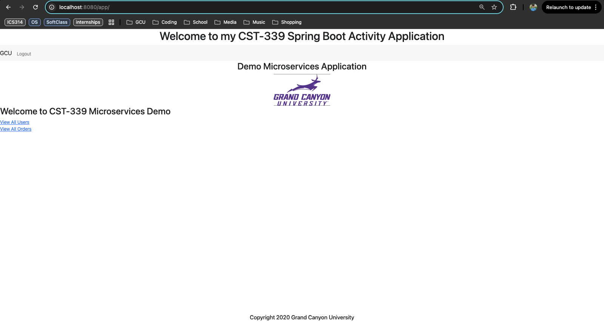
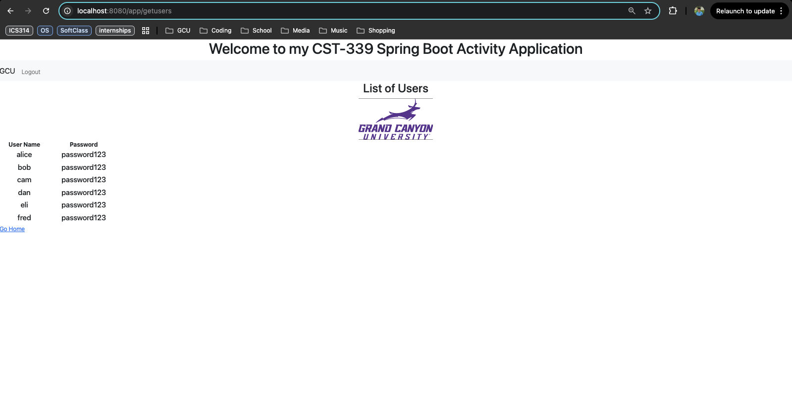
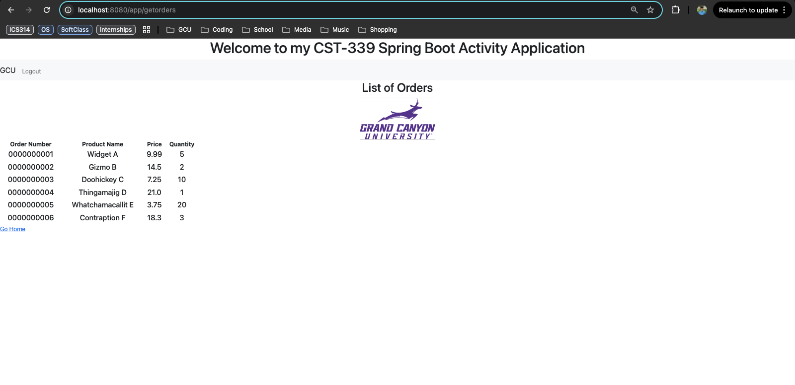
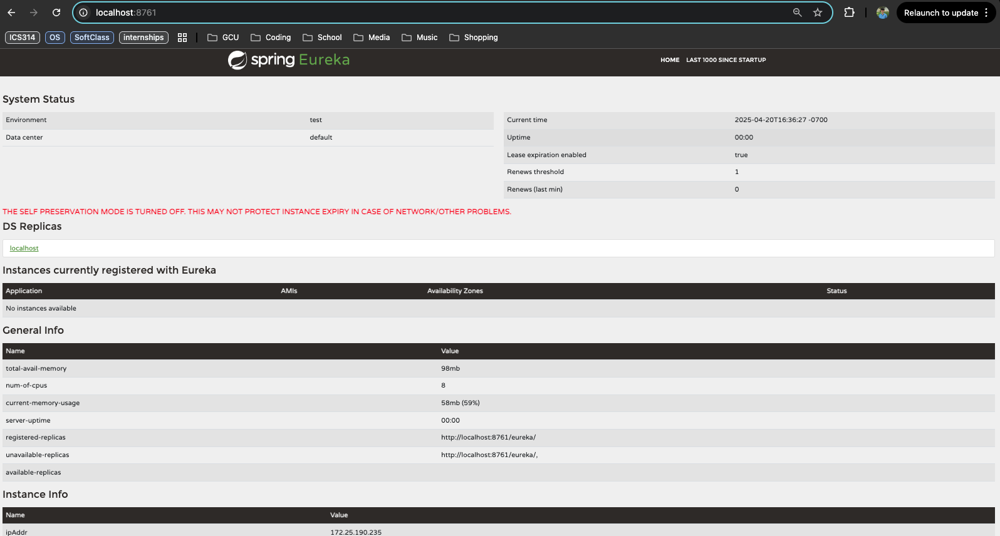
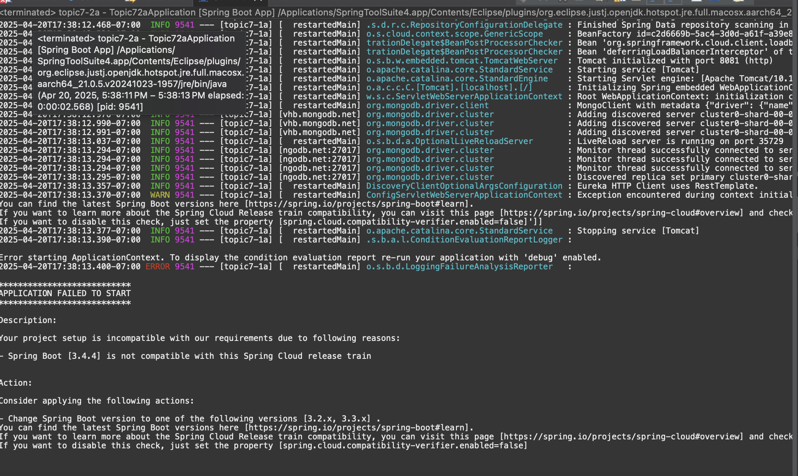
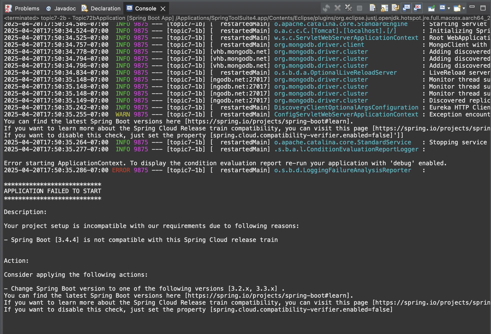
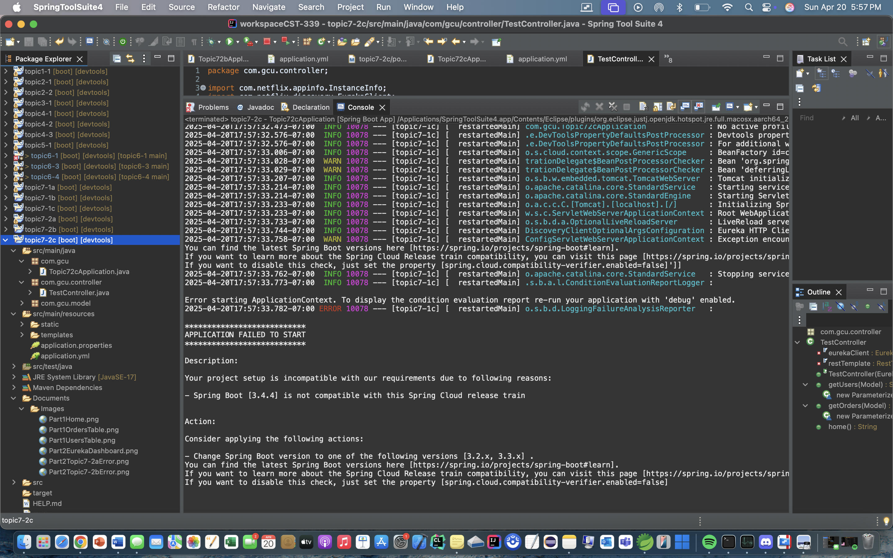

# CST-339 Activity 7 Report  
**Date:** 4/20/25  
**Name:** Elijah Brandner  

---

## 📸 Screenshots  

### Part 1 – Building a Web Application that Consumes Microservices  
- **Home Page:**  
    
- **Users Table:**  
    
- **Orders Table:**  
    

### Part 2 – Integrating a REST Service Registry and Discovery Service  
- **Eureka Server Dashboard (no instances registered):**  
    
- **Error starting topic7-2a (User Service):**  
    
- **Error starting topic7-2b (Order Service):**  
    
- **Error starting topic7-2c (Web Application):**  
    

---

## ⚠️ Part 2 Errors Explained  

1. **Version Compatibility Check Failure**  
   Each service failed to start with the message:  
   > *“Spring Boot [3.4.4] is not compatible with this Spring Cloud release train…”*  
   The built‑in compatibility verifier in Spring Cloud 2022.x blocks Boot 3.4.x.  

2. **Missing Eureka Client Annotation**  
   After copying the projects, the `@EnableEurekaClient` (or `@EnableDiscoveryClient`) annotation could not be resolved because the Netflix Eureka Client dependency wasn’t correctly managed under the Spring Cloud BOM.  

3. **Application Context Initialization Errors**  
   Even once the BOM and annotations were fixed, each application threw a `BeanCreationException` during context startup (no Validator provider, missing `spring.cloud.compatibility-verifier.enabled=false`), preventing registration with Eureka.  

---

## 📌 Conclusion  

- **Part 1**: Successfully built and tested three independent microservices (users, orders, web UI). Data flows correctly via REST into Thymeleaf views.  
- **Part 2**: Integration with Eureka uncovered dependency‑management and version‑compatibility issues. To proceed, the Spring Cloud BOM must match the Boot version (or the compatibility check disabled), and all Eureka Client dependencies and annotations must be correctly imported.  

---

## 🔍 Research Questions  

### 1. What are microservices and how do they differ from monolithic architectures?  
**Microservices** split an application into autonomous, single‑responsibility services that each have their own codebase, data store, and deployment lifecycle. They communicate over lightweight APIs (e.g. REST).  
By contrast, a **monolith** bundles all features (UI, business logic, data access) into one deployable unit. Key differences include independent scaling, technology heterogeneity, fault isolation, and team autonomy in microservices versus the unified codebase and deployment in monoliths.  

### 2. Five challenges when migrating from a monolith to microservices  
1. **Service decomposition:** Defining clear, cohesive service boundaries without over‑fragmentation.  
2. **Data consistency:** Moving from ACID transactions/joins across a single database to eventual consistency and compensating transactions.  
3. **Resilience & communication:** Handling network failures, retries, timeouts, and implementing patterns like circuit breakers.  
4. **Observability:** Aggregating logs, metrics, and distributed traces across many services for effective monitoring and debugging.  
5. **Operational complexity:** Building CI/CD pipelines, service discovery, container orchestration, and configuration management at scale.  

---

## 🙏 Christian Worldview Component  

**Scenario:** Accidentally logging sensitive user data (passwords, tokens) in application logs.  
- **Risk:** Exposes PII if logs are stored insecurely or forwarded to third‑party systems.  
- **Faith‑inspired approach:**  
  1. **Stewardship (1 Peter 4:10):** We are entrusted with user data and must care for it responsibly.  
  2. **Golden Rule (Luke 6:31):** Treat user data with the same protection we’d expect for our own.  
  3. **Action plan:**  
     - Immediately mask/redact all PII in logs.  
     - Secure log storage (encryption, access controls, rotation).  
     - Update coding standards and add automated log‑scanning tests.  
     - Brief the team on secure logging best practices to prevent future lapses.  

By framing the conversation around both **ethical responsibility** and **business continuity**, we can secure user trust **without** derailing project timelines.  
